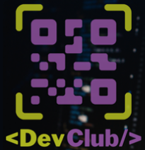

# burger shop server
 Academic project finished

> Result of the finished project. This project simulates a burger shop server.

### Adjustments and improvements

The project was fully completed and the following resources were used:

- [x] JavaScript
- [x] NODE.js
- [x] Insominia (for test)

## 🤝 Collaborators

Thanks:

<table>
    <tr>
        <td align="center">
            <a href="https://github.com/ed-radanovis">
            
             
            
                <b>Edmar Radanovis</b>
            
            </a>
        </td>
        <td align="center">
             
            
                <b>DevClub</b>
            
    </tr>
</table>

[⬆ Voltar ao topo](#burgershopserver) 